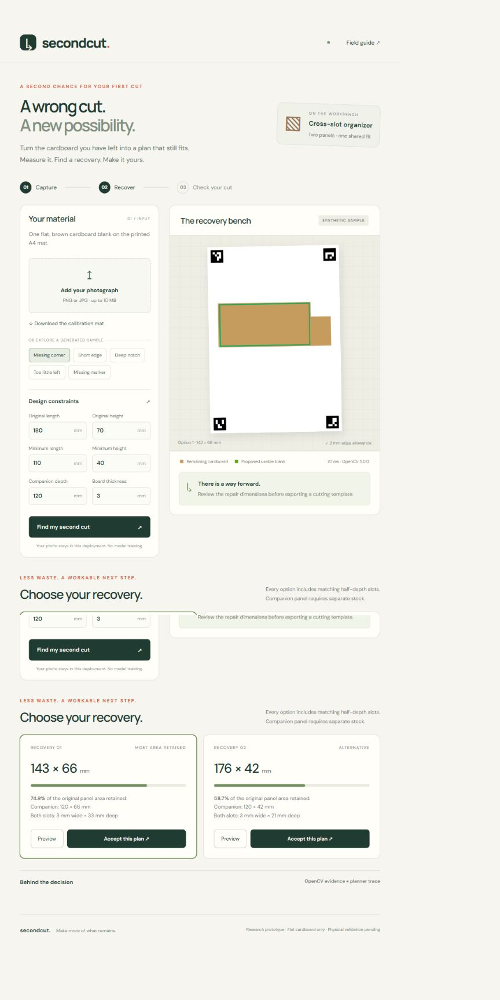
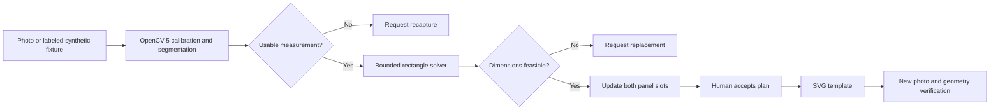

# SecondCut

**A wrong cut. A workable next step.**

SecondCut is a camera-guided research prototype that recovers a flat cardboard blank after a cutting mistake. It uses OpenCV 5 to measure the remaining outline, finds a feasible smaller rectangle, updates both panels of a cross-slot organizer insert, and verifies a recaptured panel against the accepted template.



## Current evidence and limits

- Working local web application and real OpenCV 5.0.0 image processing.
- Three supported damage types: shortened edge, missing corner, and deep notch.
- Approval-gated SVG templates, per-inspection tool traces, and geometry verification.
- All built-in samples are **synthetic**. Passing them does not establish physical measurement accuracy or assembly fit.
- AWS Lambda/S3 infrastructure is prepared but **not yet deployed or verified**.
- Real-cardboard validation, team introduction, and hosted final demo video are pending.
- The controller is deterministic, with no LLM. No COOL or special-award eligibility claim is made.

## Run locally

Use Python 3.12. From the repository root:

```text
python -m venv .venv
```

Activate `.venv` (`.venv\Scripts\Activate.ps1` on Windows, `source .venv/bin/activate` on macOS/Linux), then:

```text
python -m pip install -r requirements-dev.txt -c requirements.lock.txt
python -m uvicorn secondcut.app:app --host 127.0.0.1 --port 8000
```

Open http://127.0.0.1:8000. The header and `/api/health` report the actual OpenCV version. Internet access is not needed for the vision workflow after dependencies are installed; optional Google Fonts currently fall back to system fonts when unavailable.

## Judge walkthrough

1. Select **Missing corner** and choose **Find my second cut**.
2. Compare repair dimensions and retained main-panel area. The green outline shows the proposed blank.
3. Accept a plan. Download its SVG and inspection record.
4. Choose **Try a synthetic repaired panel**. This runs a newly generated image through the same perception and verification code.
5. Select **Too little left**, then inspect. No template should be offered.
6. Select **Missing marker**, then inspect. The controller must request recapture.
7. Use the field guide and A4 calibration PDF to collect a real photograph and repeat the workflow.

## Physical setup

Print [the calibration mat](output/pdf/secondcut-calibration-mat.pdf) on A4 at 100%. Check that top marker centers are 180 mm apart and left marker centers 267 mm apart. Put one flat matte brown blank on the white central region, horizontal relative to the mat, with all markers visible. Enter actual material thickness. Printed, pale, glossy, warped, or overlapping materials are unsupported.

The output is an organizer **insert**, not a complete box: two intersecting panels, without a base or outer walls. Panel B requires separate stock. A smaller repair changes the insert footprint. Check it suits your container. Test slot fit on spare material before cutting. The vision check assesses geometry only, not strength or physical fit.

## Architecture

See [architecture diagram](docs/architecture.svg) and [technical report](output/pdf/secondcut-technical-report.pdf).



For AWS deployment instructions and known limitations, see [infra/README.md](infra/README.md). Cloud compute is not provisioned automatically.

## Tests and evaluation

```text
python -m pytest -q
python scripts/evaluate.py
```

The evaluation report is [artifacts/evaluation.json](artifacts/evaluation.json). It includes dataset provenance, runtime versions, per-case decisions, and local timings. The nine generated cases are a regression baseline; they are not a real-world accuracy benchmark. The test suite also compares the solver with exhaustive search on small random grids and rejects a matching-size panel without the required slot.

## Data and security

Local evidence is stored under ignored `artifacts/runtime/`. Set `SECONDCUT_PASSWORD` to require HTTP Basic authentication, username `judge`. Use HTTPS outside localhost. Hosted deployments require a password and `SECONDCUT_BUCKET` for durable private S3 storage. The supplied infrastructure expires evidence objects after 30 days. No user image is sent to a model provider. This is a shared judge demo, not a multi-tenant product.

## Related work

[scrAPP](https://pure.au.dk/portal/en/publications/scrapp-enabling-reuse-of-scrap-materials-with-a-smartphone/) already explores smartphone contour capture and scrap reuse. [Fabricaide](https://hcie.csail.mit.edu/research/fabricaide/fabricaide.html) supports material-aware design. SecondCut focuses on a bounded post-error recovery loop, compatible slot propagation, and recapture verification. We claim neither a world-first method nor patent novelty.

## Submission status

Draft answers are in [docs/submission.json](docs/submission.json). They distinguish implemented behavior from pending evidence. The Devpost entry must remain unsubmitted until the participant reviews all answers and the remaining AWS/video requirements are complete.
